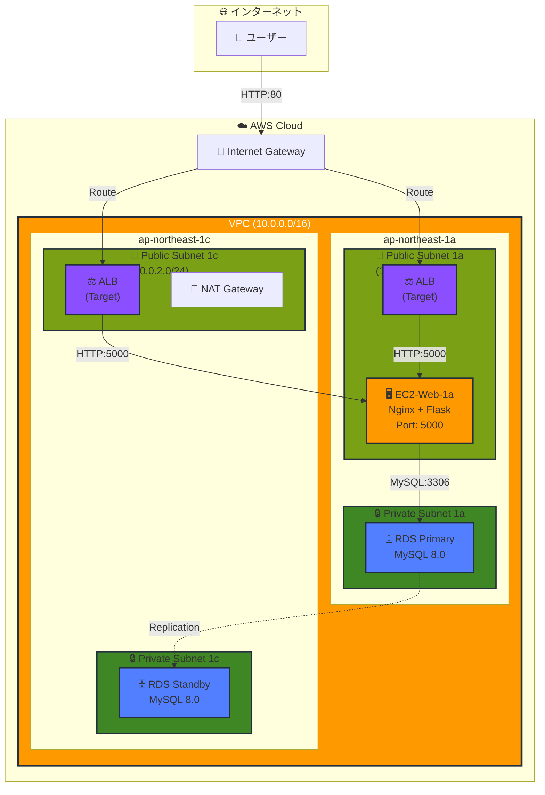

# AWS 3層Webアプリケーション ポートフォリオ

[](https://aws.amazon.com/)
[](https://www.python.org/)
[](https://flask.palletsprojects.com/)
[](https://www.terraform.io/)
[](https://www.mysql.com/)

## 📌 概要

AWS上にEC2、RDS、ALBを使用した**3層構成のTODO管理アプリケーション**を構築しました。
インフラは**Terraform**でコード化し、再現可能な構成になっています。

**🎯 このポートフォリオの目的**
- AWS実務スキルの可視化
- VPC設計・セキュリティ設計の理解を証明
- IaC（Infrastructure as Code）の実践
- 転職活動でのアピール材料

---

## 🏗️ システムアーキテクチャ



> 📊 **詳細な構成図**: `docs/architecture.png` を参照

---

## 🎯 設計のポイント

### 1. 3層アーキテクチャ
- **プレゼンテーション層**: ALB（Application Load Balancer）
- **アプリケーション層**: EC2（Nginx + Flask）
- **データベース層**: RDS（MySQL Single-AZ）

### 2. 高可用性設計
- 複数のAvailability Zone（1a, 1c）に分散配置
- ALBによる負荷分散とヘルスチェック

### 3. セキュリティ設計
- RDSをプライベートサブネットに配置（インターネットから隔離）
- セキュリティグループで最小権限の原則を適用
- NATゲートウェイ経由でプライベートサブネットからのアウトバウンド通信

### 4. 運用性
- TerraformによるIaC化（インフラの再現性・バージョン管理）

---

## 🛠️ 技術スタック

| カテゴリ | 技術 |
|--------|------|
| クラウド | AWS (VPC, EC2, RDS, ALB, NAT Gateway, Internet Gateway) |
| OS | Amazon Linux 2023 |
| 言語 | Python 3.11 |
| フレームワーク | Flask 3.0 |
| Webサーバー | Nginx 1.24 |
| データベース | MySQL 8.0 |
| IaC | Terraform 1.7 |
| バージョン管理 | Git / GitHub |

---

## 📂 ディレクトリ構成

```
aws-3tier-portfolio/
├── README.md                    # このファイル
├── docs/                        # ドキュメント・図
│   ├── architecture.png         # 詳細構成図
│   └── screenshots/             # 動作画面
├── app/                         # Flaskアプリケーション
│   ├── app.py                   # メインアプリ
│   ├── templates/
│   │   └── index.html           # フロントエンド
│   ├── requirements.txt         # Python依存関係
│   └── config.py                # 設定ファイル
├── terraform/                   # インフラコード
│   ├── main.tf                  # メイン設定
│   ├── variables.tf             # 変数定義
│   ├── outputs.tf               # 出力値
│   ├── vpc.tf                   # VPC設定
│   ├── security_groups.tf       # セキュリティグループ
│   ├── ec2.tf                   # EC2設定
│   ├── rds.tf                   # RDS設定
│   └── alb.tf                   # ALB設定
└── scripts/                     # デプロイ・セットアップスクリプト
    ├── setup_ec2.sh             # EC2初期セットアップ
    └── deploy_app.sh            # アプリデプロイ
```

---

## 🚀 セットアップ手順

### 前提条件
- AWSアカウント（無料枠推奨）
- Terraform 1.7以上インストール済み
- AWS CLI設定済み（`aws configure`）
- SSH鍵ペア作成済み

### 1. リポジトリクローン

```bash
git clone https://github.com/[your-username]/aws-3tier-portfolio.git
cd aws-3tier-portfolio
```

### 2. Terraformで環境構築

```bash
cd terraform

# 初期化
terraform init

# tfvars ファイル作成（.gitignore対象）
cat > terraform.tfvars <<EOF
myip        = "$(curl -s ifconfig.me)/32"
key_name    = "your-key-pair-name"
db_password = "YourStrongPassword123!"
EOF

# 実行計画確認
terraform plan

# リソース作成（約10分）
terraform apply

# 出力値（ALBのDNS名など）を確認
terraform output
```

### 3. アプリケーションデプロイ

```bash
# EC2にSSH接続
ssh -i ~/.ssh/portfolio-key.pem ec2-user@<EC2-Public-IP>

# リポジトリクローン
git clone https://github.com/[your-username]/aws-3tier-portfolio.git
cd aws-3tier-portfolio/app

# 依存関係インストール
pip3 install -r requirements.txt

# 環境変数設定
export DB_HOST=<RDS-Endpoint>
export DB_USER=admin
export DB_PASS=<your-password>
export DB_NAME=todo_db

# アプリ起動
python3 app.py
```

### 4. 動作確認

```bash
# ALBのDNS名でアクセス
http://<ALB-DNS-Name>
```

---

## 🔐 セキュリティ設計

### セキュリティグループ設計

#### SG-ALB（Application Load Balancer用）
| タイプ | プロトコル | ポート | 送信元 |
|------|----------|------|------|
| インバウンド | HTTP | 80 | 0.0.0.0/0 |
| インバウンド | HTTPS | 443 | 0.0.0.0/0 |

#### SG-EC2（Webサーバー用）
| タイプ | プロトコル | ポート | 送信元 |
|------|----------|------|------|
| インバウンド | SSH | 22 | マイIP |
| インバウンド | カスタムTCP | 5000 | SG-ALB |

#### SG-RDS（データベース用）
| タイプ | プロトコル | ポート | 送信元 |
|------|----------|------|------|
| インバウンド | MySQL | 3306 | SG-EC2 |

---

## 💰 コスト見積もり（月間）

| サービス | スペック | 月額（USD） | 無料枠 |
|--------|--------|-----------|------|
| EC2 | t2.micro | $0 | 750時間/月 |
| RDS | db.t3.micro (Single-AZ) | $0 | 750時間/月 |
| ALB | - | ~$16 | なし |
| NAT Gateway | - | ~$32 | なし |
| **合計** | | **~$48** | |

> 💡 **コスト削減のコツ**: 学習後は `terraform destroy` で全削除

---

## 📈 今後の改善・拡張案

- [ ] Auto Scaling: EC2の自動スケーリング実装
- [ ] CloudFront: CDN配信で高速化
- [ ] Route 53: 独自ドメイン設定
- [ ] CI/CD: GitHub Actions でデプロイ自動化
- [ ] コンテナ化: ECS/Fargate への移行
- [ ] 監視強化: CloudWatch Logs, Alarms 設定
- [ ] バックアップ: RDS自動バックアップ設定
- [ ] WAF: AWS WAFでセキュリティ強化
- [ ] SSL/TLS: ACMで証明書発行、HTTPS化

---

## 📄 ライセンス

MIT License

---

## 👤 作成者

**藤原優性**

- 💼 職歴: エンジニア派遣営業（6ヶ月）、パートナーSier営業（現職）
- 🎓 資格: AWS SAA / SAP、CCNA、宅地建物取引士
- 📚 学習予定: LPIC Level 1、Oracle SQL Silver
- 🎯 目標: クラウドエンジニアとして上流工程に携わる

---

⭐ このリポジトリが参考になったら、Starをお願いします！
